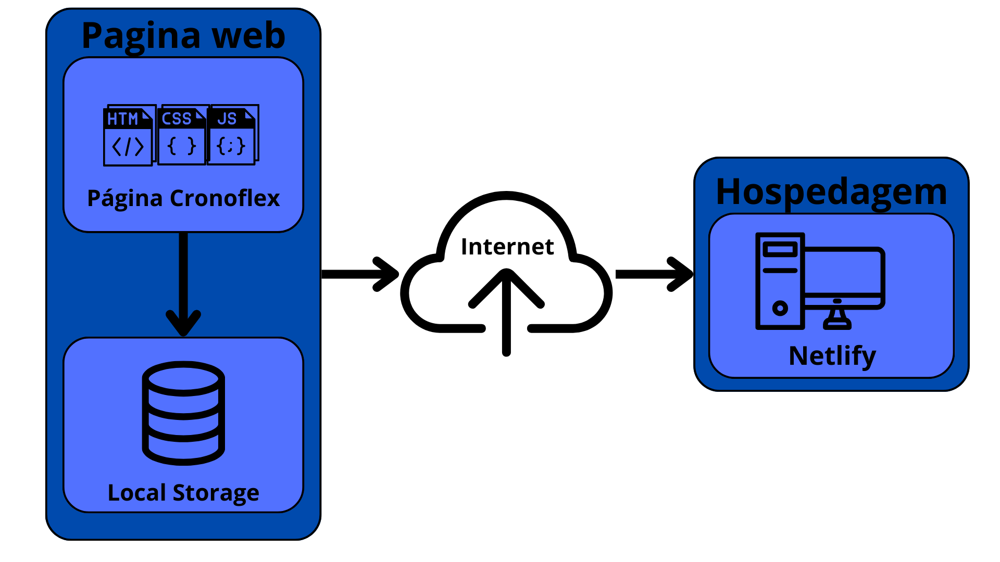

# Informações do Projeto
`TÍTULO DO PROJETO`  

**CronoFlex**

`CURSO` 

**Engenharia de Software - CAMPUS CORAÇÃO EUCARÍSTICO - NOITE**

## Participantes

Os membros do grupo são: 
 - Arthur Modesto Couto
 - Bernardo Pace Pereira Arantes
 - Italo Vinhas Antunes Sulva
 - João Paulo Gobira Lopes Costa
 - João Victor dos Santos Nogueira

# Estrutura do Documento

- [Informações do Projeto](#informações-do-projeto)
  - [Participantes](#participantes)
- [Estrutura do Documento](#estrutura-do-documento)
- [Introdução](#introdução)
  - [Problema](#problema)
  - [Objetivos](#objetivos)
  - [Justificativa](#justificativa)
  - [Público-Alvo](#público-alvo)
- [Especificações do Projeto](#especificações-do-projeto)
  - [Personas e Mapas de Empatia](#personas-e-mapas-de-empatia)
  - [Histórias de Usuários](#histórias-de-usuários)
  - [Requisitos](#requisitos)
    - [Requisitos Funcionais](#requisitos-funcionais)
    - [Requisitos não Funcionais](#requisitos-não-funcionais)
  - [Restrições](#restrições)
- [Projeto de Interface](#projeto-de-interface)
  - [User Flow](#user-flow)
  - [Wireframes](#wireframes)
- [Metodologia](#metodologia)
  - [Divisão de Papéis](#divisão-de-papéis)
  - [Ferramentas](#ferramentas)
  - [Controle de Versão](#controle-de-versão)
- [Projeto da Solução](#projeto-da-solução)
  - [Tecnologias Utilizadas](#tecnologias-utilizadas)
  - [Arquitetura da solução](#arquitetura-da-solução)
- [Avaliação da Aplicação](#avaliação-da-aplicação)
  - [Plano de Testes](#plano-de-testes)
  - [Ferramentas de Testes (Opcional)](#ferramentas-de-testes-opcional)
  - [Registros de Testes](#registros-de-testes)
- [Referências](#referências)

# Introdução

## Problema

O problema a ser resolvido é o de Má Organização de Tempo, que é causado por diversos motivos como: procastinação, falta de planejamento, desorganização, entre outros. O contexto da aplicação é pessoal, sendo mais utilizado para organização pessoal. 

## Objetivos

O objetivo do projeto é desenvolver um software para solucionar a má organização de tempo através da possibilidade do usuário cadastrar, listar e verificar quais as tarefas que tem naquele periodo de tempo, tendo também a possibilidade de ver pequenos informativos sobre sua propria organização e maneiraas de executar tal tarefa eficientemente. Dessa forma, o software serve como um gerenciador de tarefas para o mesmo ter mais controle sobre seu tempo.

## Justificativa

A importância de trabalhar com esta aplicação é a forma que o serviço facilita em diversas situações do cotidiano de diversos usuários, incluindo os desenvolvedores do projeto que também são beneficiados com o software. Além disso, com as recompensas e o assistente, a aplicação se torna diferente das outras, contribuindo para o incentivo de melhorar a organização do tempo.

## Público-Alvo

O público-alvo é principalmente para aqueles que possuem dificuldade de organizar o seu tempo, sendo principalmente estudantes, autônomos, estagiários, professores, desenvolvedores e outros. 
 
# Especificações do Projeto

Stakeholders:
- Fundamentais: Desenvolvedores, estudantes e prestadores de serviço.
- Importantes: Neuro divergentes e autonomos.
- Influenciadores: professores e outros aplicativos de gerenciamento.
  

## Personas e Mapas de Empatia

As personas juntamente com os mapas de empatia criadas para o projeto são:

## Histórias de Usuários

Com base na análise das personas forma identificadas as seguintes histórias de usuários:

|EU COMO... `PERSONA`| QUERO/PRECISO ... `FUNCIONALIDADE` |PARA ... `MOTIVO/VALOR`                   |
|--------------------|------------------------------------|------------------------------------------|
|Usuário             | Registrar minhas tarefas           | Conseguir organiza-las                   |
|Usuário             | Lembrar minhas tarefas             | Não me esquecer de cumpri-las            |
|Usuário             | De alguma motivação                | Conseguir realizar as tarefas devidamente|
|Administrador       | De uma pagina para artigos         | Colocar escritos que auxiliem o usuario  | 

## Requisitos

As tabelas que se seguem apresentam os requisitos funcionais e não funcionais que detalham o escopo do projeto.

### Requisitos Funcionais

|ID    | Descrição do Requisito  | Prioridade |
|------|-----------------------------------------|----|
|RF-001| Permitir que o usuário cadastre tarefas | ALTA | 
|RF-002| Emitir um relatório de tarefas no mês   | MÉDIA |
|RF-003| Definir Prazos e Lembretes   | ALTA |
|RF-004| Marcar Tarefas como Concluídas   | ALTA |
|RF-005| Filtrar Tarefas por Categoria ou Prioridade   | MÉDIA |
|RF-006| Que um assistente interaja com o usuário  | MÉDIA |
|RF-007| Que um assistente lembre o usuário de suas tarefas  | MÉDIA |
|RF-008| Que o usuário ao completar suas tarefas, consiga recompensas por elas  | MÉDIA |
|RF-009| Permitir que o usuário acesse um informativo com dicas  | BAIXA |
|RF-0010| Permitir que o usuário consiga editar seu perfil  | BAIXA |

### Requisitos não Funcionais

|ID     | Descrição do Requisito  |Prioridade |
|-------|-------------------------|----|
|RNF-001| O sistema deve ser responsivo para rodar em um dispositivos móvel | MÉDIA | 
|RNF-002| Deve processar requisições do usuário em no máximo 3s |  BAIXA | 

## Restrições

O projeto está restrito pelos itens apresentados na tabela a seguir.

|ID| Restrição                                             |
|--|-------------------------------------------------------|
|01| O projeto deverá ser entregue até o final do semestre |
|02| Não pode ser desenvolvido um módulo de backend        |

# Projeto de Interface

: Na interface, o objetivo é que a solução seja intuitiva, responsiva e leve, para que o máximo de usuários de diferentes dispositivos consigam usar o CronoFlex.

## User Flow

## Wireframes

**Tela de Cadastro**:

**Tela de Login**:

**Tela de Apresentação**:

**Tela do Calendário**:

**Tela Informativa**:

**Tela do Perfil**:

**Tela de Tarefas**:

# Metodologia

Resolvemos adotar a metodologia do Scrum, utilizando um planner para visualizar quais tarefas devemos realizar a cada sprint (essas definidas pelos professores), permitindo assim que possamos acompanhar o processo de confecção da interface de forma mais simples.

## Divisão de Papéis

A divisão de tarefas foi que cada integrante ficará com 2 funcionalidades, sejam elas realizar as media queries para tornar a interface responsiva ou as mais complexas e que serão feitas no futuro como projetar o assistente virtual da interface.

## Ferramentas

| Ambiente  | Plataforma              |Link de Acesso |
|-----------|-------------------------|---------------|
|Processo de Design Thinkgin  | Miro | [ https://miro.com](https://miro.com/app/board/uXjVNiWnu8Y=/) | 
|Repositório de código | GitHub | [https://github.com](https://github.com/ICEI-PUC-Minas-PMGES-TI/pmg-es-2024-1-ti1-2401100-g2-ma-organizacao-de-tempo-1) | 
|Hospedagem do site | Netlify |  [https://netlify.com](https://cronoflex.netlify.app/projetos/views/descricao/description.html) | 
|Protótipo Interativo | Figma | [https://figma.com](https://www.figma.com/design/iQMHstsrCU4ADBZIrXrY6j/CronoFlex?node-id=59-74&t=zWeQZHOEgOLQZW5d-1) | 

## Controle de Versão

Utilizamos a ferramenta de vercionamento GitHub, e o app `Netlify` para hospedagem.
Seguimos a seguinte legenda para as branchs:

- `master`: versão estável já testada do software
- `integration`: versão de testes e instável
- `nome-desenvolvedor`: versão de desenvolvimento do software com o nome do autor que a desenvolveu

Cada integrante realizava suas tarefas em suas branches especificas e depois as mesmas eram integradas e verificadas
para uso dentro da feeamenta como um todo.
Branches que tinham problemas não resolviveis ou de alta complexidade era verificadas e corrigidas se possivel.

**Exemplo - GitHub Feature Branch Workflow**:

# Projeto da Solução

O projeto da solução foi realizado no figma, sendo mais tarde passado para as linguagens
utilizadas para confeccionar uma página web.

## Tecnologias Utilizadas

Tendo em vista que o projeto é uma aplicação Web, as tecnologias
usadas para programar foram:
HTML, CSS e Javascript, com alguns usos do framework Bootstrap

A IDE escolhida para programar a solução foi:
VisualCode

Utilizamos o framework Bootstrap para facilitar a implementação e o uso de responsividade

## Arquitetura da solução

Utilizamos o app Netlify para hospedar a página, facilitando assim a visão da página em um ambiente
real.

# Avaliação da Aplicação

Os testes realizados envolviam verificar se o usuário cadastrado estava realmente salvo
dentro do local storage da aplicação.

Também verificar se as funcionalidades (cadastro de tarefas, listagem de tarefas, conclusão e compensação)
estavam plenamente funcionais.

Verificar também se o cadastro de novos usuários estava funcional. realmente salvando os dados do usuário.

Verificar se a funcionalidade de alterar dados do perfil realmente permite alterar e salvar os dados
do perfilo do usuário.

## Plano de Testes

Os cenários de testes escolhidos foram os seguintes:

**Teste de cadastro**
Nesse cenário, testamos se a aplicação permitia a um novo usuário se cadastrar e se
as telas com as outras funcionalidades estavam acessíveis a ele.

**Teste de registro de tarefa**
Nesse cenário, após logar com um usuário válido, testamos se a aplicação realmente
registrava e salvava as tarefas que o mesmo incluia em seu calendário, também
verificando se a mesma era marcada como concluída.

**Teste de alteração de perfil**
Neste cenário, após logar com um usuário válido, verificamos se era possível
alterar os dados presentes no perfil do mesmo e salvar de forma que os
dados poderiam ser alterados de forma simples pelon próprio usuário.

**Teste de listagem de tarefas**
Nesse cenário, testamos se as tarefas apareceriam listadas na aplicação se
estivesse logada com um usuário válido e se fossem as tarefas daquele usuário.

## Ferramentas de Testes (Opcional)

Não foi utilizada uma ferramenta expecifica para testes.

## Registros de Testes

Dentro dos cenários de testes que realizamos, conseguimos realizar todas as tarefas
sem maiores problemas, porém inicialmente tivemos que verificar se os usuarios realmente
conseguiam acessar todas as funcionalidades perfeitamente se fossem validados.

Também verificamos se as tarefas eram salvas apenas para aquele usuário e
se eram listados perfeitamente.

As funcionalidades proncipais funcionaram perfeitamente no geral.

# Referências

MIRO, G2 - Má Organização do Tempo 1. Disponível em: https://miro.com . Acesso em: 14 de abril 2024 
Github, Repositório. Disponível em: https://github.com . Acesso em: 30 de junho 2024 
Netfly, Hospedagem. Disponível em: https://netlify.com. Acesso em: 30 de junho 2024 
Figma, Design. Disponível em: https://www.figma.com. Acesso em: 14 de abril 2024 
Eurekka, Rotina e Saúde Mental: 7 dicas práticas para se organizar. Disponível em: https://blog.eurekka.me/rotina-e-saude-mental/?ist_privacy_policy=accepted. Acesso em: 19 de maio 2024 

