# Informações do Projeto
`TÍTULO DO PROJETO`  

CronoFlex

`CURSO` 

Engenharia de Software - CAMPUS CORAÇÃO EUCARÍSTICO - NOITE

## Participantes

Os membros do grupo são: 
> - Arthur Modesto Couto
> - Bernardo Pace Pereira Arantes
> - Italo Vinhas Antunes Sulva
> - João Paulo Gobira Lopes Costa
> - João Victor dos Santos Nogueira

# Estrutura do Documento

- [Informações do Projeto](#informações-do-projeto)
  - [Participantes](#participantes)
- [Estrutura do Documento](#estrutura-do-documento)
- [Introdução](#introdução)
  - [Problema](#problema)
  - [Objetivos](#objetivos)
  - [Justificativa](#justificativa)
  - [Público-Alvo](#público-alvo)
- [Especificações do Projeto](#especificações-do-projeto)
  - [Personas e Mapas de Empatia](#personas-e-mapas-de-empatia)
  - [Histórias de Usuários](#histórias-de-usuários)
  - [Requisitos](#requisitos)
    - [Requisitos Funcionais](#requisitos-funcionais)
    - [Requisitos não Funcionais](#requisitos-não-funcionais)
  - [Restrições](#restrições)
- [Projeto de Interface](#projeto-de-interface)
  - [User Flow](#user-flow)
  - [Wireframes](#wireframes)
- [Metodologia](#metodologia)
  - [Divisão de Papéis](#divisão-de-papéis)
  - [Ferramentas](#ferramentas)
  - [Controle de Versão](#controle-de-versão)
- [**############## SPRINT 1 ACABA AQUI #############**](#-sprint-1-acaba-aqui-)
- [Projeto da Solução](#projeto-da-solução)
  - [Tecnologias Utilizadas](#tecnologias-utilizadas)
  - [Arquitetura da solução](#arquitetura-da-solução)
- [Avaliação da Aplicação](#avaliação-da-aplicação)
  - [Plano de Testes](#plano-de-testes)
  - [Ferramentas de Testes (Opcional)](#ferramentas-de-testes-opcional)
  - [Registros de Testes](#registros-de-testes)
- [Referências](#referências)

# Introdução

## Problema

O problema a ser resolvido é o de Má Organização de Tempo, que é causado por diversos motivos como: procastinação, falta de planejamento, desorganização, entre outros. O contexto da aplicação é pessoal, sendo mais utilizado para organização pessoal. 

## Objetivos

O objetivo do projeto é desenvolver um software para solucionar a má organização de tempo através da possibilidade do usuário cadastrar, listar e verificar quais as tarefas que tem naquele periodo de tempo, tendo também a possibilidade de ver pequenos informativos sobre sua propria organização e maneiraas de executar tal tarefa eficientemente. Dessa forma, o software serve como um gerenciador de tarefas para o mesmo ter mais controle sobre seu tempo.

## Justificativa

A importância de trabalhar com esta aplicação é a forma que o serviço facilita em diversas situações do cotidiano de diversos usuários, incluindo os desenvolvedores do projeto que também são beneficiados com o software. Além disso, com as recompensas e o assistente, a aplicação se torna diferente das outras, contribuindo para o incentivo de melhorar a organização do tempo.

## Público-Alvo

O público-alvo é principalmente para aqueles que possuem dificuldade de organizar o seu tempo, sendo principalmente estudantes, autônomos, estagiários, professores, desenvolvedores e outros. 
 
# Especificações do Projeto

Stakeholders:
- Fundamentais: Desenvolvedores, estudantes e prestadores de serviço.
- Importantes: Neuro divergentes e autonomos.
- Influenciadores: professores e outros aplicativos de gerenciamento.
  

## Personas e Mapas de Empatia

As personas juntamente com os mapas de empatia criadas para o projeto são:

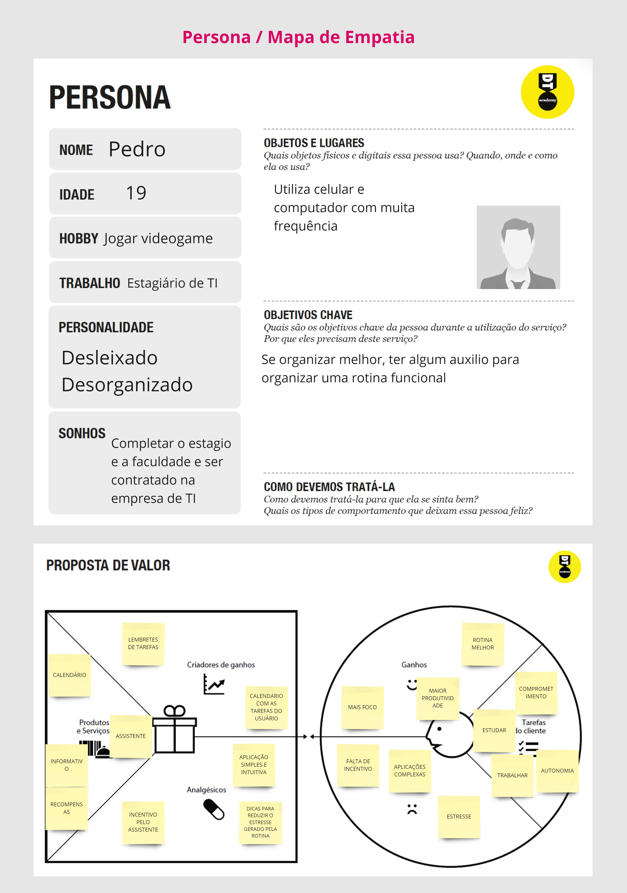
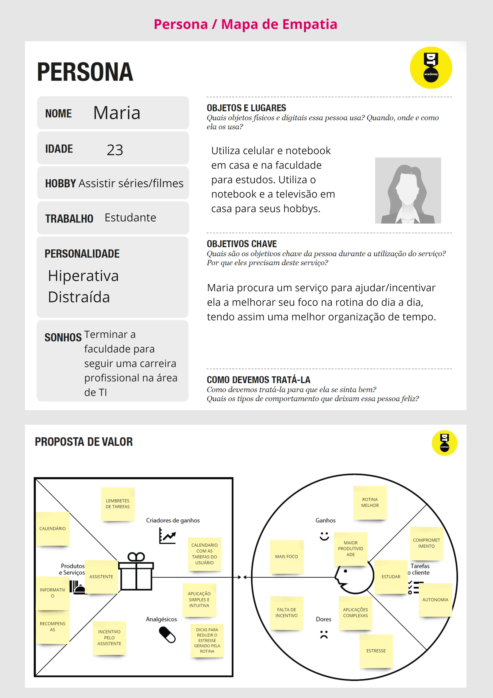
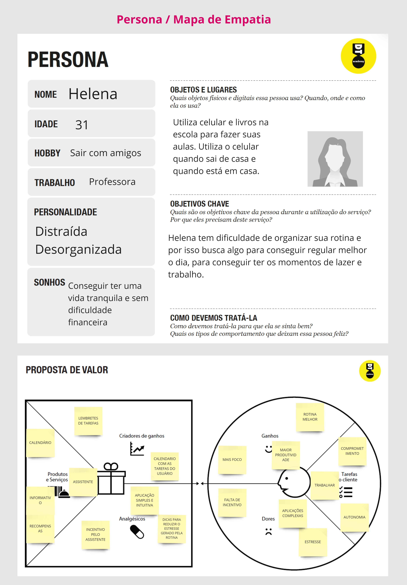

## Histórias de Usuários

Com base na análise das personas forma identificadas as seguintes histórias de usuários:

|EU COMO... `PERSONA`| QUERO/PRECISO ... `FUNCIONALIDADE` |PARA ... `MOTIVO/VALOR`                   |
|--------------------|------------------------------------|------------------------------------------|
|Usuário             | Registrar minhas tarefas           | Conseguir organiza-las                   |
|Usuário             | Lembrar minhas tarefas             | Não me esquecer de cumpri-las            |
|Usuário             | De alguma motivação                | Conseguir realizar as tarefas devidamente|
|Administrador       | De uma pagina para artigos         | Colocar escritos que auxiliem o usuario  | 

## Requisitos

As tabelas que se seguem apresentam os requisitos funcionais e não funcionais que detalham o escopo do projeto.

### Requisitos Funcionais

|ID    | Descrição do Requisito  | Prioridade |
|------|-----------------------------------------|----|
|RF-001| Permitir que o usuário cadastre tarefas | ALTA | 
|RF-002| Emitir um relatório de tarefas no mês   | MÉDIA |
|RF-003| Definir Prazos e Lembretes   | ALTA |
|RF-004| Marcar Tarefas como Concluídas   | ALTA |
|RF-005| Filtrar Tarefas por Categoria ou Prioridade   | MÉDIA |
|RF-006| Que um assistente interaja com o usuário  | MÉDIA |
|RF-007| Que um assistente lembre o usuário de suas tarefas  | MÉDIA |
|RF-008| Que o usuário ao completar suas tarefas, consiga recompensas por elas  | MÉDIA |
|RF-009| Permitir que o usuário acesse um informativo com dicas  | BAIXA |
|RF-0010| Permitir que o usuário consiga editar seu perfil  | BAIXA |

### Requisitos não Funcionais

|ID     | Descrição do Requisito  |Prioridade |
|-------|-------------------------|----|
|RNF-001| O sistema deve ser responsivo para rodar em um dispositivos móvel | MÉDIA | 
|RNF-002| Deve processar requisições do usuário em no máximo 3s |  BAIXA | 

## Restrições

O projeto está restrito pelos itens apresentados na tabela a seguir.

|ID| Restrição                                             |
|--|-------------------------------------------------------|
|01| O projeto deverá ser entregue até o final do semestre |
|02| Não pode ser desenvolvido um módulo de backend        |

# Projeto de Interface

Nesta área do relatório serão apresentadas todo o Projeto de Interface, incluindo o User Flow e os Wireframes. Na interface, o objetivo é que a solução seja intuitiva, responsiva e leve, para que o máximo de usuários de diferentes dispositivos consigam usar o CronoFlex.

## User Flow

......  INCLUA AQUI O DIAGRAMA COM O FLUXO DO USUÁRIO NA APLICAÇÃO ......

> Fluxo de usuário (User Flow) é uma técnica que permite ao desenvolvedor
> mapear todo fluxo de telas do site ou app. Essa técnica funciona
> para alinhar os caminhos e as possíveis ações que o usuário pode
> fazer junto com os membros de sua equipe.

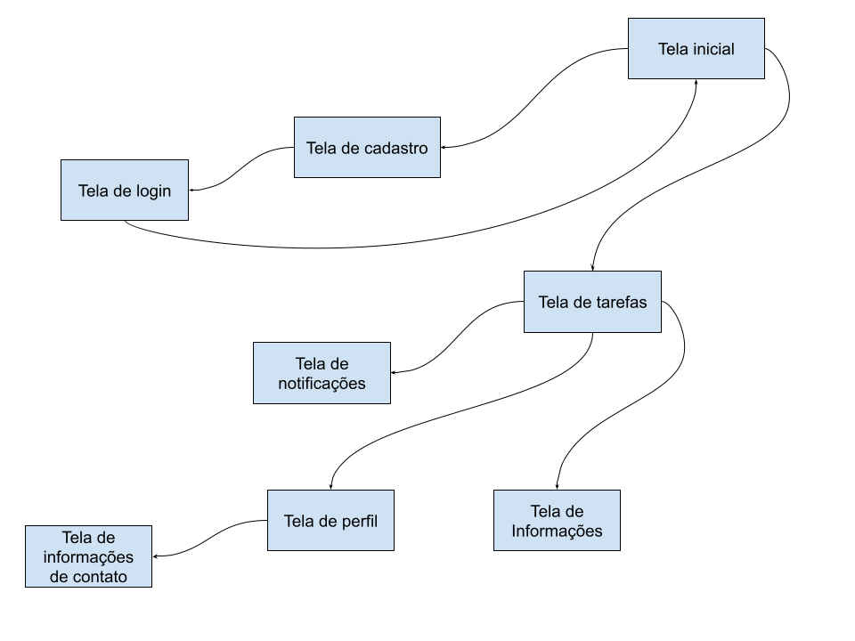

> **Links Úteis**:
> - [User Flow: O Quê É e Como Fazer?](https://medium.com/7bits/fluxo-de-usu%C3%A1rio-user-flow-o-que-%C3%A9-como-fazer-79d965872534)
> - [User Flow vs Site Maps](http://designr.com.br/sitemap-e-user-flow-quais-as-diferencas-e-quando-usar-cada-um/)
> - [Top 25 User Flow Tools & Templates for Smooth](https://www.mockplus.com/blog/post/user-flow-tools)
>
> **Exemplo**:
> 
> 

## Wireframes

**Tela de Cadastro**:

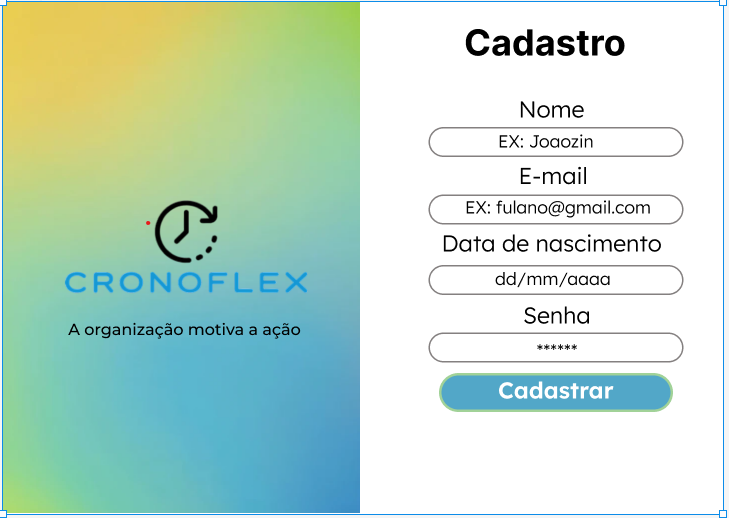

**Tela de Login**:

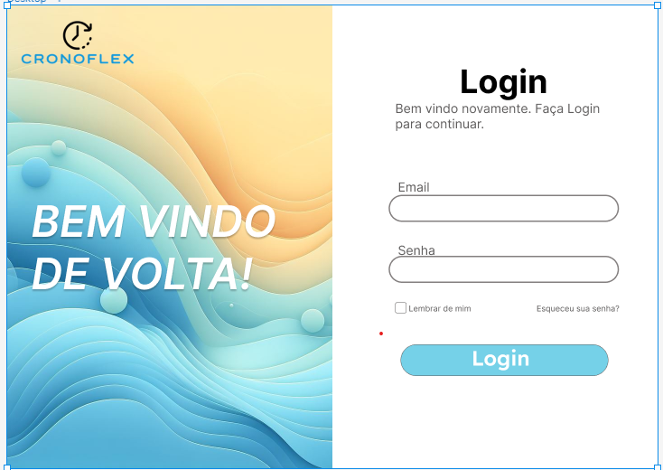

**Tela de Apresentação**:

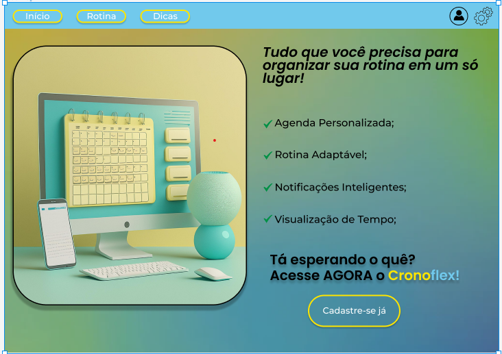

**Tela do Calendário**:

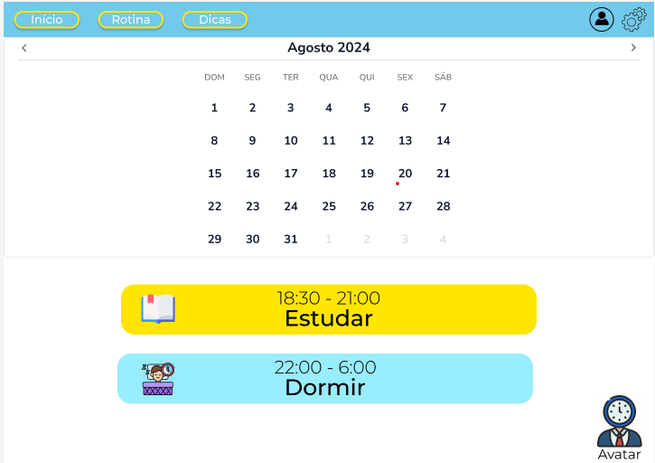

**Tela Informativa**:

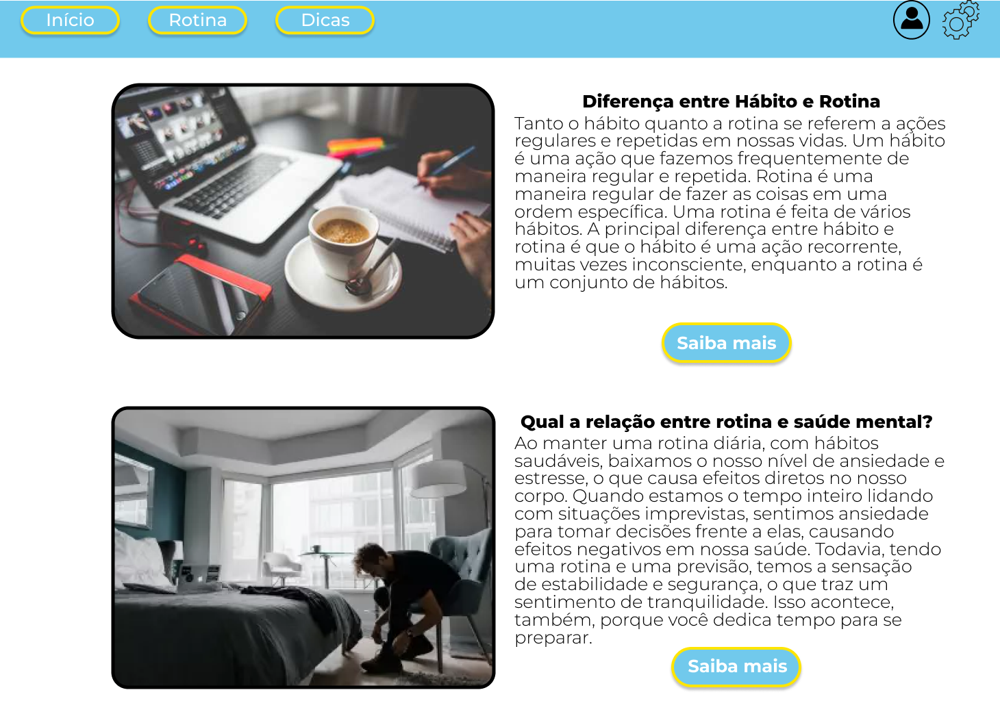

**Tela do Perfil**:

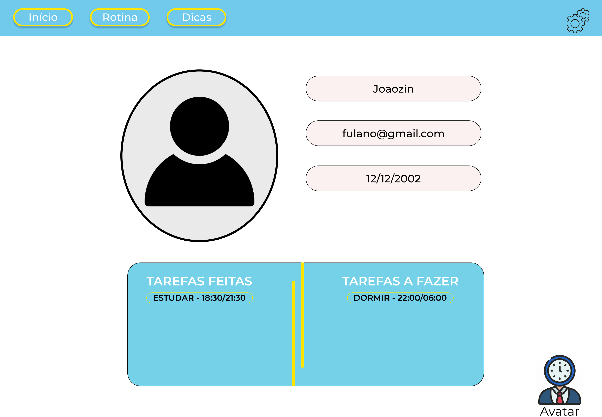

**Tela de Tarefas**:

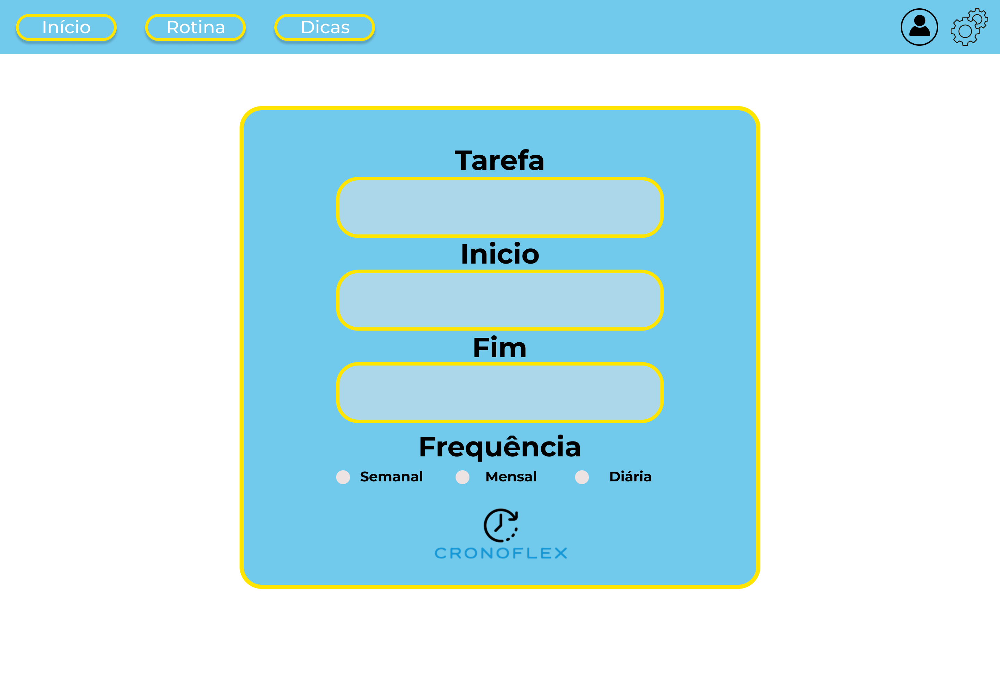

# Metodologia

Resolvemos adotar a metodologia do Scrum, utilizando um planner para visualizar quais tarefas devemos realizar a cada sprint (essas definidas pelos professores), permitindo assim que possamos acompanhar o processo de confecção da interface de forma mais simples.

## Divisão de Papéis

A divisão de tarefas foi que cada integrante ficará com 2 funcionalidades, sejam elas realizar as media queries para tornar a interface responsiva ou as mais complexas e que serão feitas no futuro como projetar o assistente virtual da interface.

## Ferramentas

| Ambiente  | Plataforma              |Link de Acesso |
|-----------|-------------------------|---------------|
|Processo de Design Thinkgin  | Miro | [ https://miro.com](https://miro.com/app/board/uXjVNiWnu8Y=/) | 
|Repositório de código | GitHub | [https://github.com](https://github.com/ICEI-PUC-Minas-PMGES-TI/pmg-es-2024-1-ti1-2401100-g2-ma-organizacao-de-tempo-1) | 
|Hospedagem do site | Netify |  [https://netlify.com](https://cronoflex.netlify.app/) | 
|Protótipo Interativo | Figma | [https://figma.com](https://www.figma.com/design/iQMHstsrCU4ADBZIrXrY6j/CronoFlex?node-id=59-74&t=zWeQZHOEgOLQZW5d-1) | 

## Controle de Versão

> Utilizamos a ferramenta de vercionamento GitHub, e o app `Netlify` para hospedagem.
> Seguimos a seguinte legenda para as branchs:
>
> - `master`: versão estável já testada do software
> - `integration`: versão de testes e instável
> - `nome-desenvolvedor`: versão de desenvolvimento do software com o nome do autor que a desenvolveu
>
> Cada integrante realizava suas tarefas em suas branches especificas e depois as mesmas eram integradas e verificadas
> para uso dentro da feeamenta como um todo.
> Branches que tinham problemas não resolviveis ou de alta complexidade era verificadas e corrigidas se possivel.
> 
> **Links Úteis**:
> - [Tutorial GitHub](https://guides.github.com/activities/hello-world/)
> - [Git e Github](https://www.youtube.com/playlist?list=PLHz_AreHm4dm7ZULPAmadvNhH6vk9oNZA)
> - [5 Git Workflows & Branching Strategy to deliver better code](https://zepel.io/blog/5-git-workflows-to-improve-development/)
>
> **Exemplo - GitHub Feature Branch Workflow**:
>
> 

# **############## SPRINT 1 ACABA AQUI #############**

# Projeto da Solução

......  COLOQUE AQUI O SEU TEXTO ......

## Tecnologias Utilizadas

......  COLOQUE AQUI O SEU TEXTO ......

> Tendo em vista que o projeto é uma aplicação Web, as tecnologias
> usadas para programar foram:
> HTML, CSS e Javascript, com alguns usos do framework Bootstrap
>
> A IDE escolhida para programar a solução foi:
> VisualCode

> Utilizamos o framework Bootstrap para facilitar a implementação e o uso de responsividade

## Arquitetura da solução

......  COLOQUE AQUI O SEU TEXTO E O DIAGRAMA DE ARQUITETURA .......

> Inclua um diagrama da solução e descreva os módulos e as tecnologias
> que fazem parte da solução. Discorra sobre o diagrama.
> 
> **Exemplo do diagrama de Arquitetura**:
> 
> 

# Avaliação da Aplicação

......  COLOQUE AQUI O SEU TEXTO ......

> Apresente os cenários de testes utilizados na realização dos testes da
> sua aplicação. Escolha cenários de testes que demonstrem os requisitos
> sendo satisfeitos.

## Plano de Testes

......  COLOQUE AQUI O SEU TEXTO ......

> Enumere quais cenários de testes foram selecionados para teste. Neste
> tópico o grupo deve detalhar quais funcionalidades avaliadas, o grupo
> de usuários que foi escolhido para participar do teste e as
> ferramentas utilizadas.
> 
> **Links Úteis**:
> - [IBM - Criação e Geração de Planos de Teste](https://www.ibm.com/developerworks/br/local/rational/criacao_geracao_planos_testes_software/index.html)
> - [Práticas e Técnicas de Testes Ágeis](http://assiste.serpro.gov.br/serproagil/Apresenta/slides.pdf)
> -  [Teste de Software: Conceitos e tipos de testes](https://blog.onedaytesting.com.br/teste-de-software/)

## Ferramentas de Testes (Opcional)

......  COLOQUE AQUI O SEU TEXTO ......

> Comente sobre as ferramentas de testes utilizadas.
> 
> **Links Úteis**:
> - [Ferramentas de Test para Java Script](https://geekflare.com/javascript-unit-testing/)
> - [UX Tools](https://uxdesign.cc/ux-user-research-and-user-testing-tools-2d339d379dc7)

## Registros de Testes

......  COLOQUE AQUI O SEU TEXTO ......

> Discorra sobre os resultados do teste. Ressaltando pontos fortes e
> fracos identificados na solução. Comente como o grupo pretende atacar
> esses pontos nas próximas iterações. Apresente as falhas detectadas e
> as melhorias geradas a partir dos resultados obtidos nos testes.

# Referências

......  COLOQUE AQUI O SEU TEXTO ......

> Inclua todas as referências (livros, artigos, sites, etc) utilizados
> no desenvolvimento do trabalho.
> 
> **Links Úteis**:
> - [Formato ABNT](https://www.normastecnicas.com/abnt/trabalhos-academicos/referencias/)
> - [Referências Bibliográficas da ABNT](https://comunidade.rockcontent.com/referencia-bibliografica-abnt/)
